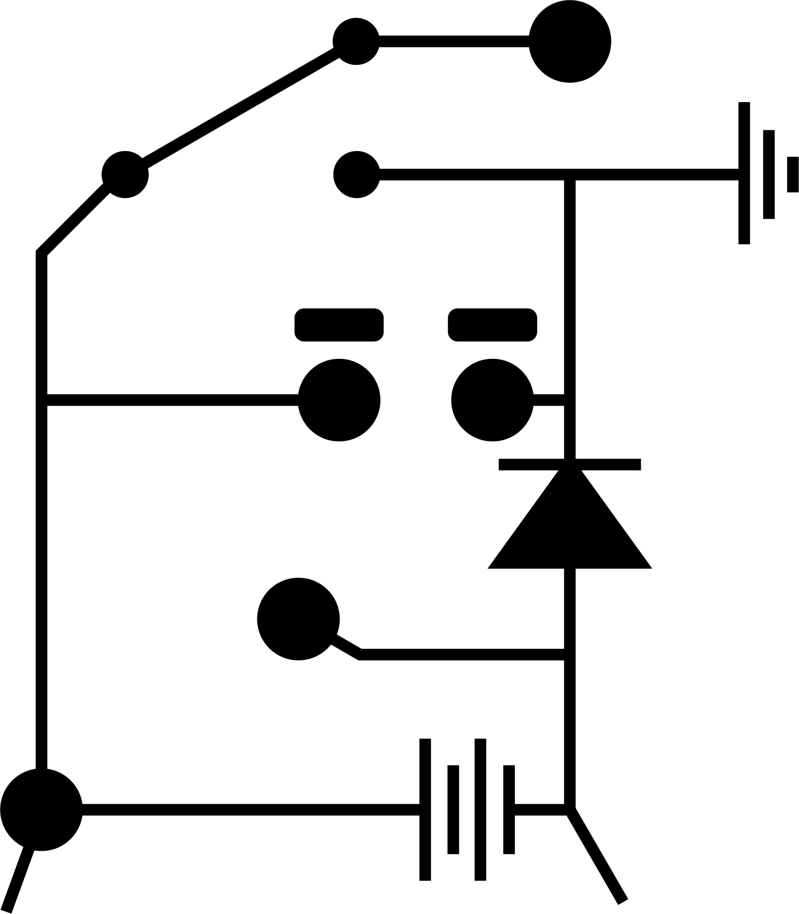

<!-- Improved compatibility of back to top link: See: https://github.com/othneildrew/Best-README-Template/pull/73 -->

<!--
*** Thanks for checking out the Best-README-Template. If you have a suggestion
*** that would make this better, please fork the repo and create a pull request
*** or simply open an issue with the tag "enhancement".
*** Don't forget to give the project a star!
*** Thanks again! Now go create something AMAZING! :D
-->

<!-- PROJECT SHIELDS -->
<!--
*** I'm using markdown "reference style" links for readability.
*** Reference links are enclosed in brackets [ ] instead of parentheses ( ).
*** See the bottom of this document for the declaration of the reference variables
*** for contributors-url, forks-url, etc. This is an optional, concise syntax you may use.
*** https://www.markdownguide.org/basic-syntax/#reference-style-links
-->
[![Contributors][contributors-shield]][contributors-url]
[![Forks][forks-shield]][forks-url]
[![Stargazers][stars-shield]][stars-url]
[![Issues][issues-shield]][issues-url]

<!-- PROJECT LOGO -->
 

    
  </a>

  <h2 align="center">DAHL DESIGN   PROPERTIES</h2>

  <h3 
 SimHub plugin for iRacing.</h3>
<h4 
 1/4 of the quadfecta 
     
    <a href="https://github.com/andreasdahl1987/DahlDesignProperties">Properties</a>
    ·
    <a href="https://github.com/andreasdahl1987/DahlDesignLED">LED</a>
    ·
    <a href="https://github.com/andreasdahl1987/DahlDesignDash">Dashboard</a>
    ·
    <a href="https://github.com/andreasdahl1987/DahlDesignDDC">DDC</a>
  

  <h5 align="center">Welcome to the repository!     To get the most out of this plugin, I highly recommend checking out the manual.</h5>
 <h2 
 <a href=https://dahl-design.gitbook.io/properties/>MANUAL</a>
</h2>

<!-- MARKDOWN LINKS & IMAGES -->
<!-- https://www.markdownguide.org/basic-syntax/#reference-style-links -->
[contributors-shield]: https://img.shields.io/github/contributors/andreasdahl1987/DahlDesignProperties.svg?style=for-the-badge
[contributors-url]: https://github.com/andreasdahl1987/DahlDesignProperties/graphs/contributors
[forks-shield]: https://img.shields.io/github/forks/andreasdahl1987/DahlDesignProperties.svg?style=for-the-badge
[forks-url]: https://github.com/andreasdahl1987/DahlDesignProperties/network/members
[stars-shield]: https://img.shields.io/github/stars/andreasdahl1987/DahlDesignProperties.svg?style=for-the-badge
[stars-url]: https://github.com/andreasdahl1987/DahlDesignProperties/stargazers
[issues-shield]: https://img.shields.io/github/issues/andreasdahl1987/DahlDesignProperties.svg?style=for-the-badge
[issues-url]: https://github.com/andreasdahl1987/DahlDesignProperties/issues
