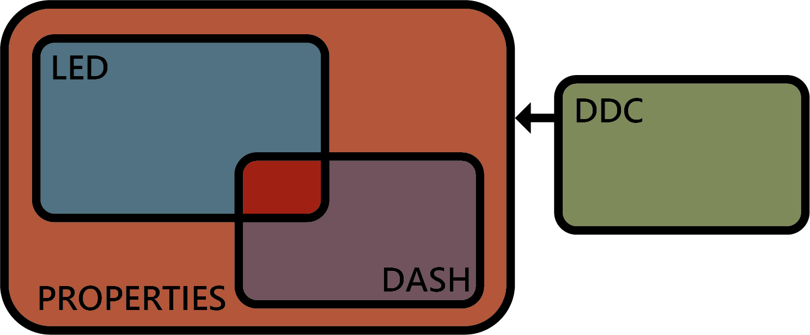

# Dependencies

The plugin is 1/4th of a complete dashboard/controller system, including RGB LED control and controller firmware. All though a part of a bigger system, the Properties plugin sits on top of the hierarchy and _does not have any dependencies_.

<figure><figcaption>
An illustration of the relationship between the 4.
</figcaption></figure>

* [Properties plugin](https://github.com/andreasdahl1987/DahlDesignProperties) -> Generates new properties for iRacing and controls the LED plugin
  * No dependencies
* [LED plugin](https://github.com/andreasdahl1987/DahlDesignLED) -> LED control for Dahl Design DDU and SW1
  * Dependent on Properties plugin
* [Dashboard](https://github.com/andreasdahl1987/DahlDesignDash) -> iRacing specific dashboard template
  * Dependent on Properties plugin
  * Dependent on LED plugin to very little extent, only if using the simulated LEDs in the dash. It is advicable to have both installed though.
* [DDC](https://github.com/andreasdahl1987/DahlDesignDDC) -> Universal controller firmware builder
  * DDC has no dependencies. It is installed on a controller, not a computer. It will work on any system, even if SimHub is not installed. Though it can send information to the Properties plugin.
