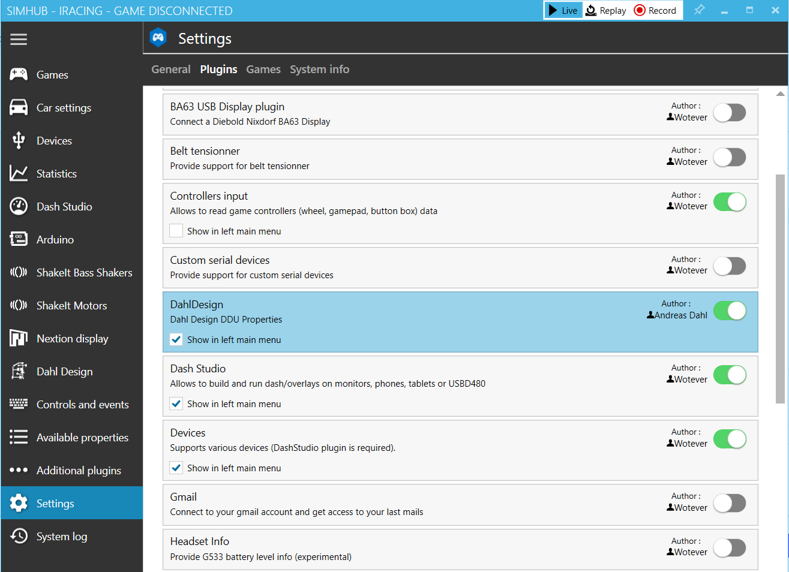

# Install

### Download .dll



* Get the latest release from GitHub repository page. You'll only need the `DahlDesign.dll` file.
* The file goes into your SimHub main folder. Typically C:\Program Files(x86)\SimHub
* Restart SimHub and you'll get a prompt that a new plugin has been found.

### Plugin in SimHub

You'll find the plugin here. You can also check the box to have a shortcut to the plugin menu on the left hand side. The menu has a lot of useful content, so I would strongly recommend it.

<figure><figcaption></figcaption></figure>

### Additional setup

#### Wheel slip

A special feature that requires a little extra setup is the **wheel slip properties.** These properties use the ShakeITMotorsV3Plugin to get slip values, then filters these values a bit.

You'll have to activate the slip effects in the ShakeIT Motors plugin page and export the values as a properties named "WheelSlip". Case sensitive. If you dont need the effect for you Arduino, just set volume to 0.

<figure><figcaption></figcaption></figure>

#### Plugin setup

Navigate to the **Plugin setup** page in the plugin menu. Bind you shifter paddles/sequential shifter. A few calculations in the plugin needs to know if you've done a gearshift, and by the time the iRacing telemetry has updated your current gear, the relevant information is already lost. So keeping track of the actual shifter button press is necessary.&#x20;

<figure><figcaption></figcaption></figure>
