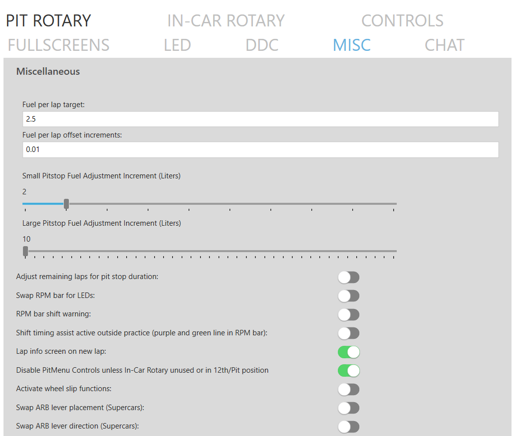

# Plugin menu

The plugin menu will serve as a control center for the interaction between the plugin and the three other pieces of Dahl Design software: [Dashboard](https://github.com/andreasdahl1987/DahlDesignDash), [LED plugin](https://github.com/andreasdahl1987/DahlDesignLED) and [DDC](https://github.com/andreasdahl1987/DahlDesignDDC). Now you know that it exists. What it does is covered in the manual where it is relevant.&#x20;

<figure><figcaption></figcaption></figure>
